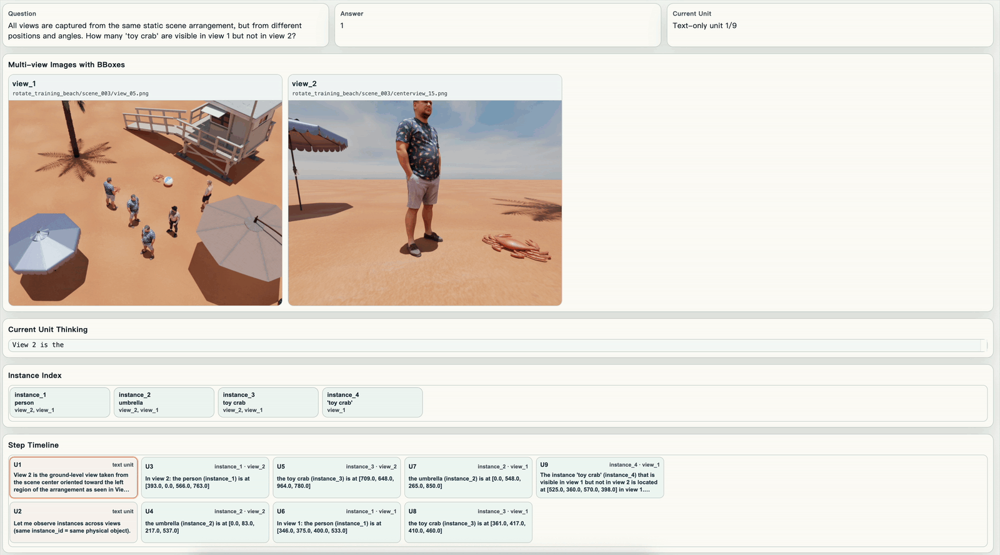

<p align="center">
  
</p>

<h1 align="center">VIEW2SPACE: Studying Multi-View Visual Reasoning from Sparse Observations</h1>

<h2 align="center">Accepted to ECCV 2026 🚀 </h2>

<p align="center">
  
</p>

<p align="center">
  <a href="http://arxiv.org/abs/2603.16506"></a>
  
  <a href="https://huggingface.co/collections/Pokerme/view2space"></a>
  <a href="https://pokerme7777.github.io/VIEW2SPACE/"></a>
</p>

## Motivation

> **Why VIEW2SPACE?**  
> A single glance is often insufficient for completing real-world tasks. Humans naturally integrate observations across sparse viewpoints to form a shared spatial understanding. Given heterogeneous views (e.g., robotic dog and drone), one can efficiently align what different agents observe and reason across sparse viewpoints.


## Announcement

We are preparing the first public release of VIEW2SPACE resources.

- **Paper status:** Accepted to ECCV 2026 🚀
- **Hugging Face collection:** [`VIEW2SPACE`](https://huggingface.co/collections/Pokerme/view2space)
- **Testing set release:** [`view2space-v1`](https://huggingface.co/datasets/Pokerme/view2space-v1) ✅
- **Training data release:** [`view2space-train`](https://huggingface.co/datasets/Pokerme/view2space-train) ✅
- **Checkpoint release:** [`view2space_GCoT_4b_checkpoint`](https://huggingface.co/Pokerme/view2space_4b) ✅

## Training Data Release

We have released the VIEW2SPACE training data on Hugging Face:
[`view2space-train`](https://huggingface.co/datasets/Pokerme/view2space-train).
The release includes grounded chain-of-thought supervision for multi-view
spatial reasoning, connecting sparse visual observations with step-by-step
spatial reasoning traces.

Upcoming release items:

- [ ] 3D environments
- [ ] Data-generation interfaces for custom data collection

<p align="center">
  
</p>

## Quick Start

For public evaluation, start here:

- `src/README.md`
- `src/eval/run_all_subsets.sh`

Source code is organized by responsibility:

- `src/eval`: public evaluation entrypoints
- `src/train`: training launchers and preprocessing helpers
- `src`: shared prompt, message-building, and config files


## Citation

If you find VIEW2SPACE useful in your research, please cite:

```bibtex
@article{ke2026view2space,
  title={VIEW2SPACE: Studying Multi-View Visual Reasoning from Sparse Observations},
  author={Ke, Fucai and Cai, Zhixi and Li, Boying and Chen, Long and Lin, Beibei and Wang, Weiqing and Haghighi, Pari Delir and Haffari, Gholamreza and Rezatofighi, Hamid},
  journal={arXiv preprint arXiv:2603.16506},
  year={2026}
}
```
