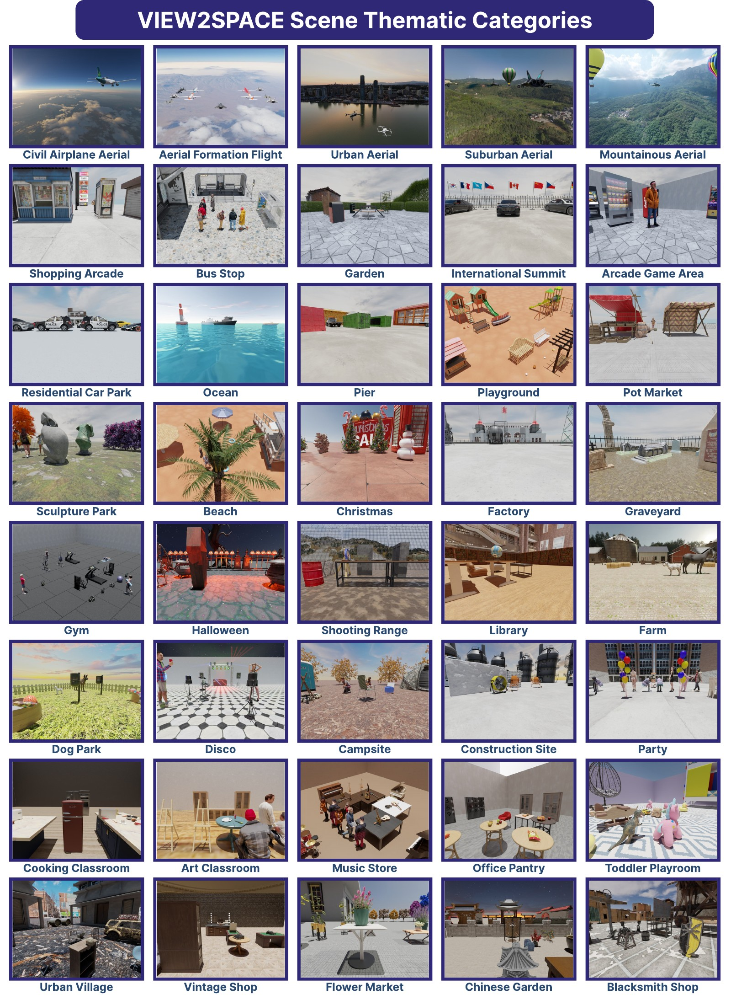
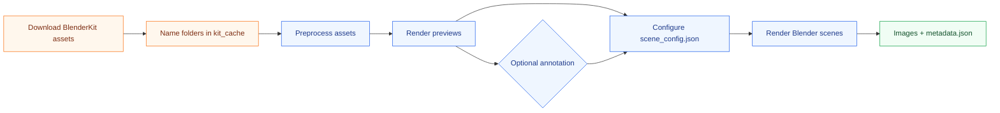

<h1 align="center">VIEW2SPACE Scene Generation</h1>

<p align="center">
  <strong>Blender asset preparation · Preview rendering · Configurable scene synthesis</strong>
</p>

<p align="center">
  <a href="../README.md">Project README</a> ·
  <a href="./config/scene_config.json">Scene Config</a> ·
  <a href="./scripts/generate_scene.sh">Render Script</a>
</p>

<p align="center">
  
  
  
  
  
</p>

This directory contains the release version of the Blender-based scene
generation pipeline used by VIEW2SPACE. It covers asset preprocessing, preview
rendering, optional asset annotation, and scene rendering.

<div align="left" style="max-height: 200px; overflow-y: auto; width: 60%;">
  
</div>

| Stage | Main entrypoint | Output |
| --- | --- | --- |
| Asset preparation | `scripts/prepare_example_assets.sh` | `processed_asset/*/mapping.jsonl` |
| Preview rendering | `scripts/render_previews.sh` | `processed_asset/*_preview/preview_all.png` |
| Scene rendering | `scripts/generate_scene.sh` | `scenes/<scene_name>/scene_*/` |
| Optional annotation | `scripts/annotate_assets.sh` | `<asset_name>_annotation.json` |

## Contents

- [Directory Layout](#directory-layout)
- [Pipeline Overview](#pipeline-overview)
- [Quick Start](#quick-start)
- [Environment](#environment)
- [Asset Preparation](#asset-preparation)
- [Annotation](#annotation)
- [Scene Generation](#scene-generation)
- [Scene Config Reference](#scene-config-reference)
- [Asset Scale Config Reference](#asset-scale-config-reference)
- [Citation and Support](#citation-and-support)

## Directory Layout

```text
scene_generation_src/
  Theme_preview.jpg                   # README preview image for generated scenes
  scene_pipeline_grid.py              # Main Blender scene renderer
  preprocess_cache.py                 # Normalizes downloaded BlenderKit assets
  blenderkit_preview.py               # Renders preview images for assets
  visualize.py                        # Combines previews into preview_all.png
  asset_annotation*_light.py          # Optional Azure OpenAI annotation scripts
  annotation_prompt/                  # Prompts used by annotation scripts
  config/
    scene_config.json                 # Scene generation settings
    asset_scale_config.json           # Asset folder mapping, scale, and facing
  scripts/
    prepare_example_assets.sh         # One-shot preprocessing for the example
    preprocess_asset.sh               # Preprocess one asset group
    render_previews.sh                # Render previews for one processed group
    annotate_assets.sh                # Optional annotation entrypoint
    generate_scene.sh                 # Scene rendering entrypoint
```

## Pipeline Overview



## Quick Start

Set Blender and cache paths:

```bash
export BLENDER_BIN=/path/to/blender
export BENCHMARKING_DATA_CACHE=/path/to/view2space_cache
```

Prepare the example assets after downloading them from BlenderKit:

```bash
scene_generation_src/scripts/prepare_example_assets.sh
```

Render the example scene:

```bash
scene_generation_src/scripts/generate_scene.sh example_grid_scene --data-root "$BENCHMARKING_DATA_CACHE"
```

Outputs are written to:

```text
$BENCHMARKING_DATA_CACHE/scenes/example_grid_scene/scene_001/
```

Each scene folder contains rendered images and `metadata.json`.

> [!IMPORTANT]
> 🔔 For the exact parameter settings used in the paper, please contact the authors for collaboration.

## Environment

Install Python dependencies:

```bash
pip install -r scene_generation_src/requirements.txt
```

Set the Blender executable. The scripts use `blender` by default, but setting
`BLENDER_BIN` is recommended:

```bash
export BLENDER_BIN=/path/to/blender
```

Set the cache root. This is where downloaded assets, processed assets, previews,
and rendered scenes are stored:

```bash
export BENCHMARKING_DATA_CACHE=/path/to/view2space_cache
```

For optional annotation, also set Azure OpenAI credentials:

```bash
export AZURE_OPENAI_URL=https://your-resource.openai.azure.com/
export OPENAI_API_KEY=your_api_key
```

## Asset Preparation

### Download BlenderKit Assets

Go to [BlenderKit](https://www.blendkit.com/) and download the assets you want
to use. For the included `example_grid_scene`, download:

| BlenderKit section | Download for the example |
| --- | --- |
| Models | `snowman`, `table`, `cup`, `fence` |
| Materials | Any floor or ground material folder |
| HDRIs | Any sky environment folder |

Place the downloaded folders under `$BENCHMARKING_DATA_CACHE/kit_cache/` with
these names:

```text
$BENCHMARKING_DATA_CACHE/
  kit_cache/
    snowman_cache/
    table_cache/
    cup_cache/
    fence_cache/
    materials_cache/
    sky_cache/
```

The folder names matter. They are read by
`scene_generation_src/config/asset_scale_config.json`.

### Preprocess Assets

Run the one-shot example script:

```bash
scene_generation_src/scripts/prepare_example_assets.sh
```

This runs preprocessing for:

```text
snowman, table, cup, fence, materials, sky
```

It also renders preview sheets for:

```text
snowman, table, cup, fence
```

The generated files are stored under:

```text
$BENCHMARKING_DATA_CACHE/processed_asset/
  snowman/mapping.jsonl
  table/mapping.jsonl
  cup/mapping.jsonl
  fence/mapping.jsonl
  GMAT/mapping.jsonl
  sky/mapping.jsonl
```

Preview sheets are written to:

```text
$BENCHMARKING_DATA_CACHE/processed_asset/<asset_name>_preview/preview_all.png
```

### Custom Asset Groups

For custom categories, add entries to
`scene_generation_src/config/asset_scale_config.json`, then run:

```bash
scene_generation_src/scripts/preprocess_asset.sh <source_name>
scene_generation_src/scripts/render_previews.sh <processed_asset_name>
```

For example, if `asset_scale_config.json` maps `chair_cache` to `chair`, then:

```bash
scene_generation_src/scripts/preprocess_asset.sh chair
scene_generation_src/scripts/render_previews.sh chair
```

## Annotation

Annotation is optional for scene rendering, but useful when building asset
metadata for downstream dataset tasks.

```bash
MODEL=gpt-4o scene_generation_src/scripts/annotate_assets.sh <processed_asset_name>
```

Run annotation after preprocessing and preview generation, then manually inspect
the generated annotations before using them in a dataset release.

## Scene Generation

Scene generation is controlled by:

```text
scene_generation_src/config/scene_config.json
```

Render a configured scene:

```bash
scene_generation_src/scripts/generate_scene.sh <scene_name> --data-root "$BENCHMARKING_DATA_CACHE"
```

The included example is:

```bash
scene_generation_src/scripts/generate_scene.sh example_grid_scene --data-root "$BENCHMARKING_DATA_CACHE"
```

To add a new scene:

1. Add any new `mapping.jsonl` references to top-level `asset_paths`.
2. Add a new entry under top-level `scenes`.
3. Point `scenes.<scene_name>.assets` to the asset path keys.
4. Set placement, environment, camera, and generation parameters.
5. Run `generate_scene.sh <scene_name>`.

## Scene Config Reference

`scene_config.json` has three top-level sections:

| Section | Meaning |
| --- | --- |
| `asset_paths` | Named paths to processed asset `mapping.jsonl` files. |
| `defaults` | Shared defaults used by all scenes unless overridden. |
| `scenes` | Runnable scene definitions. The key is the `<scene_name>` passed to `generate_scene.sh`. |

Relative paths in `asset_paths` are resolved under `--data-root`.

### Asset Paths

Example:

```json
"asset_paths": {
  "snowman_path": "processed_asset/snowman/mapping.jsonl",
  "table_path": "processed_asset/table/mapping.jsonl"
}
```

| Key | Type | Meaning |
| --- | --- | --- |
| `<asset_path_name>` | string | Absolute path, or path relative to `--data-root`, pointing to a `mapping.jsonl` file. |

### Defaults

Defaults are shared by every scene. A scene can override these values inside its
own `placement`, `environment`, `camera`, or `generation` sections.

| Key | Type | Meaning |
| --- | --- | --- |
| `ground_size` | float | Size of the generated ground plane in Blender units. |
| `fit_coverage` | float | Target image coverage for normal rendered views. |
| `crop_image_fit_coverage` | float | Target image coverage for cropped views. Smaller values usually zoom in more. |
| `normal_cam_deg` | float | Camera elevation angle for normal views. |
| `crop_cam_deg` | float | Camera elevation angle for cropped views. |
| `EXCLUDE_NAMES` | list[string] | Name fragments excluded from camera focus bounds. |
| `four_angles_deg` | list[float] | Allowed object Z rotations in degrees. |
| `RENDER_RESOLUTION` | `[width, height]` | Render output resolution. |
| `RENDER_SAMPLES` | int | Cycles sample count. Higher is cleaner but slower. |

### Scene Assets

These parameters live in `scenes.<scene_name>.assets`.

| Asset role | Meaning |
| --- | --- |
| `A` | Main foreground object group. |
| `B` | Secondary foreground object group. Often used as host objects. |
| `C` | Optional third object group. Often placed on or inside A/B host footprints. |
| `ground_material` | Ground material records. |
| `fence` | Fence or wall segment records placed around the scene. |
| `anchor` | Optional large reference object placed before A/B placement. |
| `outdoor_art` | Optional decorative objects outside the main arena. |
| `sky` | Optional HDRI sky records. |
| `surrounding` | Optional background assets placed around the scene boundary. |

Each asset role uses this format:

```json
"A": {
  "path": "snowman_path",
  "filters": [""]
}
```

| Field | Type | Meaning |
| --- | --- | --- |
| `path` | string | Key from top-level `asset_paths`. |
| `filters` | list[string] | Filename filters applied to `new_file` in `mapping.jsonl`. Use `[""]` or `[]` to keep all records. |

### Layout Rules

The layout is selected by the combination of A/B/C asset roles and placement
flags.

| Config combination | Behavior |
| --- | --- |
| A only, no B | Places A objects on a square `GRID_N x GRID_N` grid. |
| A + B, `RANDOM_PLACING_AB=false`, `A_ON_B_LAYOUT=false`, `linear_layout=false` | Structured rectangular layout with separate A and B cell sets. |
| A + B, `RANDOM_PLACING_AB=false`, `linear_layout=true` | Linear A layout. |
| A + B, `RANDOM_PLACING_AB=false`, `A_ON_B_LAYOUT=true`, `linear_layout=false` | Places A on or inside B using a square A layout. |
| A + B, `RANDOM_PLACING_AB=false`, `A_ON_B_LAYOUT=true`, `linear_layout=true` | Places A on or inside B using a linear A layout. |
| A + B, `RANDOM_PLACING_AB=true` | Random non-overlapping A/B placement in the arena. |
| C with `host_class="A"` | Places C on or inside A host footprints. |
| C with `host_class="B"` | Places C on or inside B host footprints. |
| C with another `host_class` value | Places C on a random mix of A and B hosts. |

### Placement

These parameters live in `scenes.<scene_name>.placement`.

| Key | Type | Meaning |
| --- | --- | --- |
| `RANDOM_PLACING_AB` | bool | Enables random non-overlapping A/B placement. |
| `A_ON_B_LAYOUT` | bool | Places A relative to B host cells. |
| `linear_layout` | bool | Uses a line arrangement for A placement. |
| `only_active_a` | bool | Used by the linear layout path to keep only active A positions. |
| `KEEP_CENTER` | bool | Reserves the central region during placement. |
| `KEEP_CENTER_VALUE` | float/int | Size of the reserved central region. |
| `GRID_N` | int | Grid dimension for structured layouts; also controls arena scale for random placement. |
| `N_ASSET_A` | int | Number of A objects sampled per scene. |
| `N_ASSET_B` | int | Number of B objects sampled per scene. |
| `N_ASSET_C` | int | Number of C objects sampled per scene. |
| `K_FENCE` | `[min, max]` | Random range for how many fence sides to build. |
| `K_OUTDOORART` | `[min, max]` | Random range for outdoor art objects. |
| `K_ANCHOR` | `[min, max]` | Random range for anchor objects. Current placement supports at most one anchor. |
| `host_class` | string | Host selection for C placement: `"A"`, `"B"`, or any other value for mixed A/B hosts. |
| `four_angles_deg` | list[float] | Optional scene-level override for allowed Z rotations. |

### Environment

These parameters live in `scenes.<scene_name>.environment`.

| Key | Type | Meaning |
| --- | --- | --- |
| `ground_size` | float | Scene-level ground size override. |
| `FENCE_CLEARANCE` | float | Offset between the main placement area and the fence. |
| `OUTDOORART_CLEARANCE` | float | Offset between the main area and outdoor art placement. |
| `OUTDOOR_FIRST` | bool | Places outdoor art before fences when true. |
| `FOCUS_ON_OUTDOORART` | bool | Includes outdoor art in the camera focus bounds. |
| `EXCLUDE_NAMES` | list[string] | Scene-level camera-focus exclusions. |
| `BUILDING_FENCE_SIDE_OPTION` | list[string] | Allowed fence sides: `top`, `bottom`, `left`, `right`. |
| `BUILDING_OUTDOOR_ART_SIDE_OPTION` | list[string] | Allowed outdoor-art sides: `top`, `bottom`, `left`, `right`. |
| `surrounding_clearance` | float | Distance from the main scene boundary to surrounding assets. |
| `surrounding_margin_between` | float | Minimum spacing between surrounding assets. |
| `surrounding_facing_center` | bool | Rotates surrounding assets to face the scene center. |

### Camera

These parameters live in `scenes.<scene_name>.camera`.

| Key | Type | Meaning |
| --- | --- | --- |
| `VIEW_FROM_CENTER` | bool | Renders additional `centerview_XX` images. |
| `CENTERVIEW_HEIGHT` | float | Optional center-view camera height. |
| `VIEW_INDICES` | list[int] | Optional fixed view codes. If omitted, views are sampled by the pipeline. |
| `fit_coverage` | float | Scene-level normal-view coverage override. |
| `crop_image_fit_coverage` | float | Scene-level crop-view coverage override. |
| `normal_cam_deg` | float | Scene-level normal camera elevation override. |
| `crop_cam_deg` | float | Scene-level crop camera elevation override. |

### Generation

These parameters live in `scenes.<scene_name>.generation`.

| Key | Type | Meaning |
| --- | --- | --- |
| `SEED_BASE` | int | Base seed for reproducibility. Scene index is added to this value. |
| `NUMBER_OF_SCENES_TO_GENERATE` | int | Number of scene folders to generate. |
| `VIEWS_PER_SCENE` | int | Number of normal views rendered per scene. |
| `RENDER_RESOLUTION` | `[width, height]` | Scene-level render resolution override. |
| `RENDER_SAMPLES` | int | Scene-level Cycles sample-count override. |

## Asset Scale Config Reference

`asset_scale_config.json` controls how downloaded BlenderKit folders become
processed asset folders.

| Section | Meaning |
| --- | --- |
| `folder_transit` | Maps a downloaded folder name under `kit_cache/` to a processed folder name under `processed_asset/`. |
| `scales` | Per-processed-asset scale multiplier applied during preprocessing when `apply_scale=true`. |
| `facing` | Per-processed-asset facing/orientation flag used by preprocessing. |
| `apply_scale` | Enables or disables applying the configured scale values. |

Example:

```json
"folder_transit": {
  "snowman_cache": "snowman",
  "materials_cache": "GMAT",
  "sky_cache": "sky"
}
```

This expects:

```text
$BENCHMARKING_DATA_CACHE/kit_cache/snowman_cache/
$BENCHMARKING_DATA_CACHE/kit_cache/materials_cache/
$BENCHMARKING_DATA_CACHE/kit_cache/sky_cache/
```

and writes:

```text
$BENCHMARKING_DATA_CACHE/processed_asset/snowman/mapping.jsonl
$BENCHMARKING_DATA_CACHE/processed_asset/GMAT/mapping.jsonl
$BENCHMARKING_DATA_CACHE/processed_asset/sky/mapping.jsonl
```

## Citation and Support

If this scene generation engine is useful for your work, please cite VIEW2SPACE.
If you find the project helpful, we would also appreciate a GitHub star.
